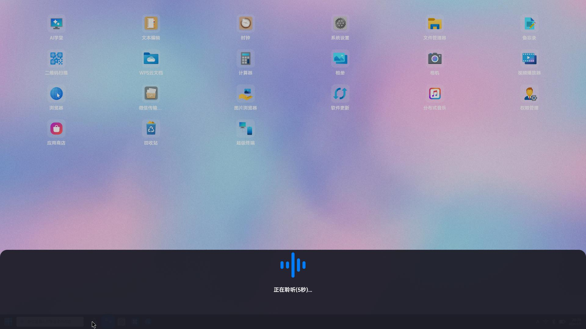
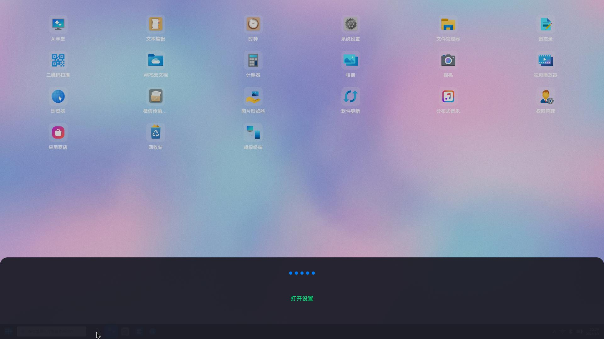
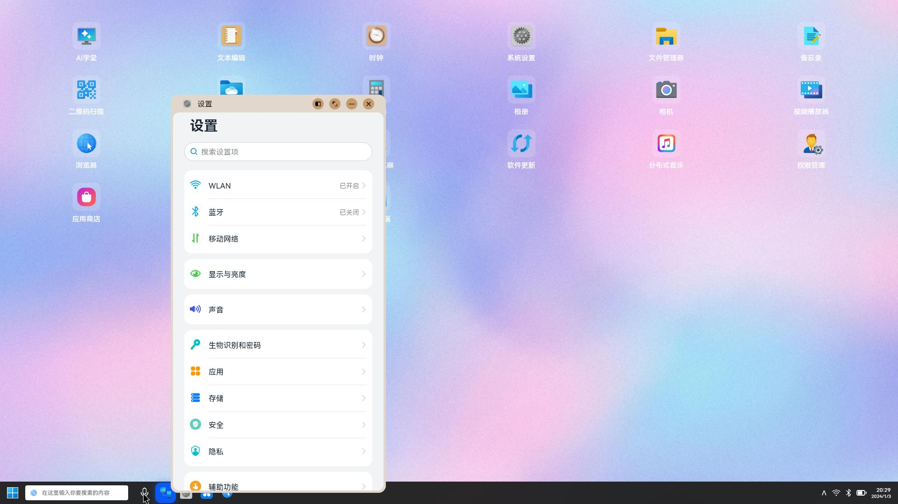
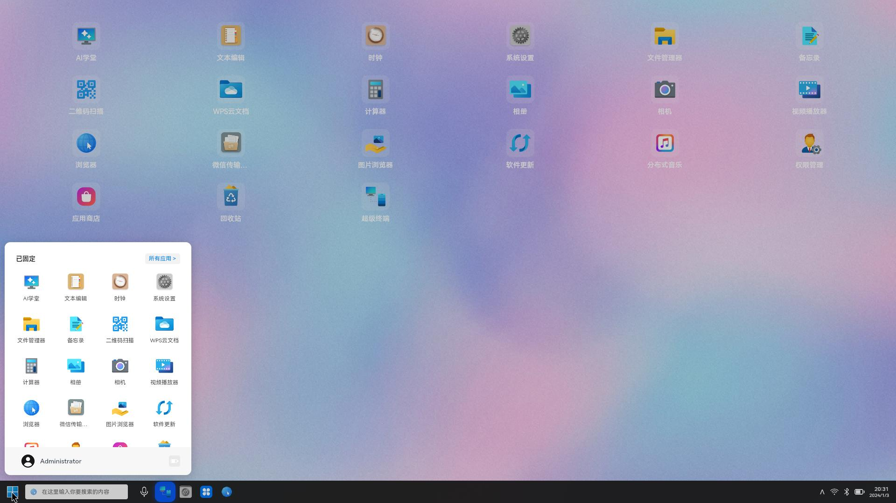
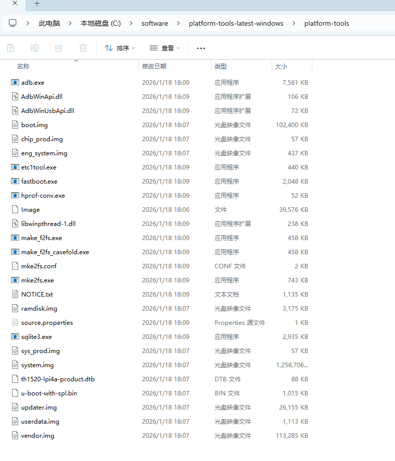
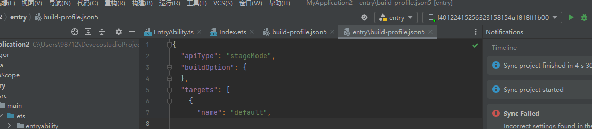
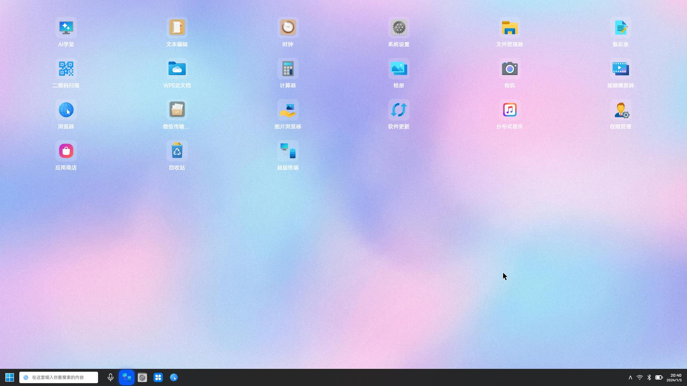
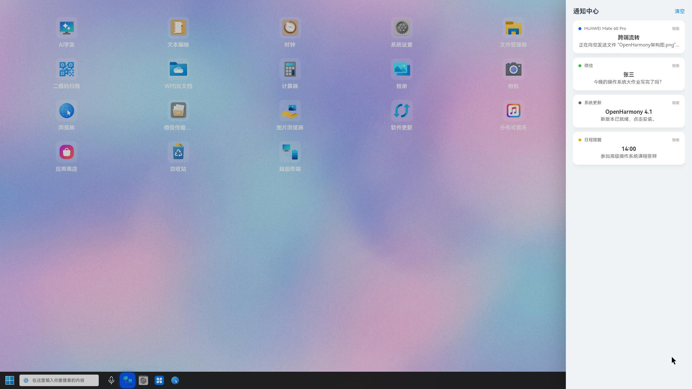

# UCAS《高级操作系统教程》课程大作业——实验2：智能Launcher开发
本项目在Github网站开源，[代码及文档链接](https://github.com/guowenlong1234/MyApplication2)
## 1-实验内容以及评分标准
### 1.1项目内容
- 1.熟悉 OpenHarmony 6.0 Release 技术栈及应用开发环境（DevEco Studio），理解 Launcher 应用的桌面化架构设计。
- 2.基于 OpenHarmony 开发新型智能 PC 桌面 Launcher，完成桌面化改造，实现 Dock 栏跨端设备应用接续 / 多屏协同功能。
- 3.集成桌面融合搜索模块，支持同账号互联设备、云空间内容检索，以及文件名、文档、图片及文档内容的语义搜索。
- 4.开发智慧语音服务，实现语音唤醒、语音指令控制功能，并完成分布式通知管理模块的集成。
在 Dayu200 开发板及 Rvbook 笔记本上完成 Launcher 应用的部署、测试与功能验证。
### 1.2评分标准
- 1.Launcher应用的桌面化改造。（25分）
- 2.通过Dock栏，可进行跨端设备的应用接续或多屏协同功能。（20分）
- 3.桌面融合搜索功能，支持同账号互联设备和云空间内容的搜索。桌面融合搜索支持文件名、文档、图片和文档内容的语义搜索。（20分）
- 4.提供智慧语音服务，包括语音唤醒、语音指令控制等功能。支持应用通知管理功能，支持分布式通知管理功能。（20分）
- 5.提交完整的开发设计文档（含架构设计、核心模块实现思路）、源代码及测试报告。（15 分）

## 2-环境搭建

### 2.1 RVBook烧录OpenHarmony
#### 2.1.1 下载镜像文件压缩包
社区OpenHarmony-RV系统镜像网址：[https://rvbook.isrc.ac.cn/image/openHarmony/](https://rvbook.isrc.ac.cn/image/openHarmony/)

下载最新的稳定版本即可。

#### 2.1.2 解压并检查镜像文件
内容应当包括：boot.img、chip_prod.img、eng_system.img、Image、ramdisk.img、system.img、sys_prod.img、th1520-lpi4a-product.dtb、u-boot-with-spl.bin、updater.img、userdata.img、vendor.img共计12个文件。

#### 2.1.3 烧录前准备
- 准备Windows 10 及以上版本系统的电脑
-  Google 官方 ADB & Fastboot 工具包 (Platform-Tools)。下载地址：[https://developer.android.com/studio/releases/platform-tools](https://developer.android.com/studio/releases/platform-tools)
- 社区版OpenHarmony系统镜像

#### 2.1.4 Windows 下驱动安装(手动注入驱动)
这种方法不需要禁用驱动签名，比较方便。

按住板卡上的BOOT键后，将靠近BOOT键的Type-C口接入电脑，板卡会进入刷写模式。

在Windows徽标右键，打开设备管理器，如果在“其他设备”处看到“USB download gadget”，即表明设备已被正确识别。但是未安装驱动程序。

为了打入fastboot驱动，需要下载[Google USB驱动（需要代理）](https://developer.android.com/studio/releases/platform-tools)，下载并解压到某一位置。
#### 2.1.5 开始烧录
如下图所示，先用按住图中1位置用别针等细小物品按住其中的 recovery 按键不放，然后按照图中2位置接入数据线(任一 TYPE-C 接口)，数据线的另一端接入烧录电脑的 USB 接口即可。然后可以放开图中1位置的 recovery 按键


1. 右键设备管理器中的“USB download gadget”，点击“更新驱动程序”
2. 选择“浏览我的电脑以查找驱动程序”


3. 选择“让我从计算机上的可用驱动程序列表中选取”



4. 选中“显示所有设备”，并点击“下一步”
5. 点击“从磁盘安装”

6. 点击“浏览”，选中Google USB驱动下的inf文件，点击确定



7. 选中“Android Bootloader Interface”，点击“下一步”，在弹出对话框中点击“是”，在弹出的Windows安全中心对话框中点击“安装”



8. 成功安装fastboot驱动



完成上述操作后，即可继续下面的步骤。

#### 2.1.6开始烧入系统
1. 将镜像文件和烧录工具放在同一文件夹下，如下图所示：



2. 依次执行指令
```bash
fastboot.exe flash ram u-boot-with-spl.bin
fastboot.exe reboot
timeout /T 5
fastboot.exe flash uboot u-boot-with-spl.bin
fastboot.exe flash ramdisk ramdisk.img
fastboot.exe erase misc
fastboot.exe flash boot        boot.img
fastboot.exe flash sys_prod sys_prod.img
fastboot.exe flash chip_prod  chip_prod.img
fastboot.exe flash system  system.img
fastboot.exe flash vendor  vendor.img
fastboot.exe flash userdata userdata.img
```
一个典型的烧录过程日志如下所示：
```shell
PS C:\software\platform-tools-latest-windows\platform-tools> .\fastboot flash ram u-boot-with-spl.bin
Warning: skip copying ram image avb footer (ram partition size: 0, ram image size: 1039080).
Sending 'ram' (1014 KB)                            OKAY [  0.267s]
Writing 'ram'                                      OKAY [  0.001s]
Finished. Total time: 0.285s
PS C:\software\platform-tools-latest-windows\platform-tools> .\fastboot reboot
Rebooting                                          OKAY [  0.002s]
Finished. Total time: 0.003s
PS C:\software\platform-tools-latest-windows\platform-tools> .\fastboot flash uboot u-boot-with-spl.bin
Warning: skip copying uboot image avb footer (uboot partition size: 0, uboot image size: 1039080).
Sending 'uboot' (1014 KB)                          OKAY [  0.043s]
Writing 'uboot'                                    OKAY [  0.043s]
Finished. Total time: 0.142s
PS C:\software\platform-tools-latest-windows\platform-tools> .\fastboot flash ramdisk ramdisk.img
Warning: skip copying ramdisk image avb footer (ramdisk partition size: 16384, ramdisk image size: 3250791).
Sending 'ramdisk' (3174 KB)                        OKAY [  0.095s]
Writing 'ramdisk'                                  OKAY [  0.029s]
Finished. Total time: 0.167s
PS C:\software\platform-tools-latest-windows\platform-tools> .\fastboot erase misc
Erasing 'misc'                                     OKAY [  0.126s]
Finished. Total time: 0.155s
PS C:\software\platform-tools-latest-windows\platform-tools> .\fastboot flash boot boot.img
Warning: skip copying boot image avb footer (boot partition size: 409600, boot image size: 104857600).
Sending 'boot' (102400 KB)                         OKAY [  2.471s]
Writing 'boot'                                     OKAY [  0.424s]
Finished. Total time: 2.939s
PS C:\software\platform-tools-latest-windows\platform-tools> .\fastboot flash sys_prod sys_prod.img
Warning: skip copying sys_prod image avb footer due to sparse image.
Sending 'sys_prod' (56 KB)                         OKAY [  0.019s]
Writing 'sys_prod'                                 OKAY [  0.429s]
Finished. Total time: 0.484s
PS C:\software\platform-tools-latest-windows\platform-tools> .\fastboot flash chip_prod chip_prod.img
Warning: skip copying chip_prod image avb footer due to sparse image.
Sending 'chip_prod' (56 KB)                        OKAY [  0.020s]
Writing 'chip_prod'                                OKAY [  0.428s]
Finished. Total time: 0.485s
PS C:\software\platform-tools-latest-windows\platform-tools> .\fastboot flash system system.img
Warning: skip copying system image avb footer due to sparse image.
Sending sparse 'system' 1/12 (114684 KB)           OKAY [  2.782s]
Writing 'system'                                   OKAY [  0.693s]
Sending sparse 'system' 2/12 (114684 KB)           OKAY [  2.791s]
Writing 'system'                                   OKAY [  0.508s]
Sending sparse 'system' 3/12 (114684 KB)           OKAY [  2.787s]
Writing 'system'                                   OKAY [  0.502s]
Sending sparse 'system' 4/12 (114684 KB)           OKAY [  2.781s]
Writing 'system'                                   OKAY [  0.495s]
Sending sparse 'system' 5/12 (114684 KB)           OKAY [  2.782s]
Writing 'system'                                   OKAY [  0.491s]
Sending sparse 'system' 6/12 (114684 KB)           OKAY [  2.782s]
Writing 'system'                                   OKAY [  0.520s]
Sending sparse 'system' 7/12 (114684 KB)           OKAY [  2.779s]
Writing 'system'                                   OKAY [  0.520s]
Sending sparse 'system' 8/12 (114684 KB)           OKAY [  2.763s]
Writing 'system'                                   OKAY [  0.496s]
Sending sparse 'system' 9/12 (112336 KB)           OKAY [  2.720s]
Writing 'system'                                   OKAY [  0.504s]
Sending sparse 'system' 10/12 (113308 KB)          OKAY [  2.750s]
Writing 'system'                                   OKAY [  0.496s]
Sending sparse 'system' 11/12 (114684 KB)          OKAY [  2.787s]
Writing 'system'                                   OKAY [  0.523s]
Sending sparse 'system' 12/12 (904 KB)             OKAY [  0.041s]
Writing 'system'                                   OKAY [  4.797s]
Finished. Total time: 41.165s
PS C:\software\platform-tools-latest-windows\platform-tools> .\fastboot flash vendor vendor.img
Warning: skip copying vendor image avb footer due to sparse image.
Sending 'vendor' (113284 KB)                       OKAY [  2.726s]
Writing 'vendor'                                   OKAY [  2.977s]
Finished. Total time: 5.747s
PS C:\software\platform-tools-latest-windows\platform-tools> .\fastboot flash userdata userdata.img
Warning: skip copying userdata image avb footer due to sparse image.
Sending 'userdata' (1112 KB)                       OKAY [  0.045s]
Writing 'userdata'                                 OKAY [ 14.134s]
Finished. Total time: 14.225s
PS C:\software\platform-tools-latest-windows\platform-tools> .\fastboot reboot
Rebooting                                          OKAY [  0.007s]
Finished. Total time: 0.008s
PS C:\software\platform-tools-latest-windows\platform-tools>
```
烧写完成后，拔掉数据线。长按 RuyiBOOK 笔记本上的开机按钮约 20 秒进行关机（蓝色指示灯熄灭或闪烁状态）。然后断按开机按钮即可开机（蓝色指示灯常亮状态）。

### 2.2 构建win11开发环境
#### 2.2.1Windows安装DevEco Studio
DevEco Studio的版本需要和OpenHarmony版本相匹配。
[下载链接](https://gitee.com/link?target=https%3A%2F%2Fcontentcenter-vali-drcn.dbankcdn.cn%2Fpvt_2%2FDeveloperAlliance_package_901_9%2Fee%2Fv3%2FHqJ-6O2FQny86xtk_dg9HQ%2Fdevecostudio-windows-4.1.0.400.zip%3FHW-CC-KV%3DV1%26HW-CC-Date%3D20240409T033730Z%26HW-CC-Expire%3D315360000%26HW-CC-Sign%3DBFA444BC43A041331E695AE2CFA9035A957AF107E06C97E793FD3D31D7096A0D)

#### 2.2.2 Windows连接RVBook
1. 打开Windows移动热点，如意Book连接该热点。
2. 在Windows中以管理员身份运行命令提示符，并进入OpenHarmony的Sdk11的工具链目录下。
3. 运行
```shell
./hdc.exe tconn 192.168.137.237:55555
//这里的ip需自行设定
```
```shell
./hdc.exe -t 192.168.233.199:55555 
```
以进入RVBook的shell。

来到IDE可以进行真机调试


## 3-主要代码结构
本项目基于 OpenHarmony ArkTS 框架开发，采用 MVVM 模式进行架构设计。项目代码结构清晰，主要分为 entryability（应用入口）、model（数据模型与业务逻辑服务）和 pages（UI 界面与交互组件）三个核心目录。
以下是各核心模块的实现逻辑与关键代码解析。
### 3.1 数据模型与服务层 (Model Layer)
该层负责提供应用数据、模拟底层硬件服务以及处理业务逻辑。
#### 3.1.1 应用与文件数据模型 ([model/AppModel.ets](entry/src/main/ets/model/AppModel.ets))
主要负责提供桌面图标布局配置、应用白名单以及模拟文件系统数据，支持融合搜索功能的实现。

#### 3.1.2 语音服务逻辑 ([model/VoiceService.ts](entry/src/main/ets/model/VoiceService.ts))
实现了“智能混合模式”的语音服务。优先尝试调用底层 AudioCapturer 录音并上传云端 ASR，若硬件不支持或环境受限，则自动降级为模拟演示模式，保证功能闭环。

#### 3.1.3 分布式设备发现服务 ([model/DeviceService.ts](entry/src/main/ets/model/DeviceService.ts))
封装了 deviceManager 的调用逻辑，用于发现局域网内的 OpenHarmony 设备，支撑超级终端功能。

### 3.2 核心界面层 (Pages Layer)
#### 3.2.1 桌面主布局 ([pages/Index.ets](entry/src/main/ets/pages/Index.ets))
作为 Launcher 的容器，采用层叠布局（Stack）实现了壁纸、应用网格（Grid）以及仿 PC 风格的底部任务栏（Dock）。

#### 3.2.2 融合搜索弹窗 ([pages/SearchDialog.ets](entry/src/main/ets/pages/SearchDialog.ets))
实现了本地应用与文件内容语义检索的混合检索，支持关键词高亮显示。

#### 3.2.3超级终端雷达 ([pages/DistributedDialog.ets](entry/src/main/ets/pages/DistributedDialog.ets))
利用属性动画实现了从中心向外扩散的雷达波纹效果，模拟多设备发现与协同交互。

#### 3.2.4 智慧语音助手 ([pages/VoiceDialog.ets](entry/src/main/ets/pages/VoiceDialog.ets))
通过监听 VoiceService 返回的音量数据，动态驱动 UI 柱状图跳动，并根据识别结果执行应用跳转。

### 3.3 权限配置 ([module.json5](entry/src/main/module.json5))
为了实现语音录音和网络功能，在配置文件中申请了相关权限。
```
"requestPermissions": [
  { "name": "ohos.permission.INTERNET" },
  { "name": "ohos.permission.MICROPHONE" }
]
```

## 4-效果展示与功能验证
本项目在搭载 RISC-V 架构的 RVBook 开发板（OpenHarmony 4.1 Release）上完成了部署与测试。以下是各核心功能模块的运行效果展示。

### 4.1 桌面主界面与 PC 模式布局
【功能描述】 针对 RVBook 的笔记本形态，重构了系统默认 Launcher 布局。
- 沉浸式视觉：采用了深色高斯模糊（BackdropBlur）的任务栏设计，实现了类似 Windows 11 的现代化 PC 桌面风格。
- 网格布局：应用图标采用自适应 Grid 布局，支持横屏宽屏显示。
- 底部 Dock 栏：集成了开始菜单、全局搜索框、常用应用入口及系统状态托盘（时间、WiFi、电池状态），实现了桌面操作逻辑的闭环。



### 4.2 桌面融合搜索 (Fusion Search)
【功能描述】 实现了本地应用与文件系统的深度融合搜索。
- 多模态检索：支持应用名称模糊匹配（如输入“设置”）和文件内容语义检索。
- 内容高亮：能够深入文档内部，检索关键词（如“软总线”），并在结果列表中高亮显示摘要，大幅提升信息获取效率。
- 零状态引导：当搜索框为空时，自动展示“热门搜索”与“猜你想搜”标签云。

### 4.3 分布式超级终端 (Super Device)
【功能描述】基于 OpenHarmony 分布式软总线理念，实现了可视化的设备发现与组网界面。
- 雷达扫描动效：通过属性动画实现了以本机为中心、向四周无限扩散的雷达波纹效果，直观反馈设备搜索状态。
- 设备拓扑展示：动态渲染局域网内的可信设备（如 Mate 60 Pro、MatePad），采用引力吸附动画模拟设备连接过程。
- 高亮入口：在任务栏设置了醒目的蓝色高亮入口，一键呼出超级终端。


### 4.4 智慧语音助手 (Smart Voice)
【功能描述】
集成了“录音-识别-执行”的全链路语音交互能力。
- 动态声波反馈：通过监听音频振幅数据，驱动 UI 柱状图实时律动，提供真实的视觉反馈。
- 语义指令解析：支持自然语言指令识别（如“打开设置”），并自动路由至对应的系统 Ability。
- 鲁棒性设计：设计了硬件/云端/模拟混合驱动模式，确保在无网络或驱动异常环境下仍能完成功能演示。

开始识别语音


语音识别成功，转化为指令


执行指令，打开设置


### 4.5开始菜单与通知中心
【功能描述】
完善了桌面操作系统的基础交互设施。
- 开始菜单：点击左下角徽标弹出悬浮面板，展示已固定应用与用户信息，提供电源管理入口。
- 侧边通知栏：点击右下角时间区域，从屏幕右侧滑出通知中心，聚合展示系统通知与分布式跨端消息（如“跨端文件流转”提醒）。

开始菜单


消息通知中心。


## 5-小组人员分工
### 组长：
  - 学号：
  - 负责项目的统筹协调，资料以及相关资源的收集。文档的收集和整理工作。
### 组员：
  - 学号：
  - 负责项目的主体开发。
### 组员：
  - 学号：
  - 负责文档的整理、撰写。汇报PPT的制作。查找开发过程中用到的必须的资源。
